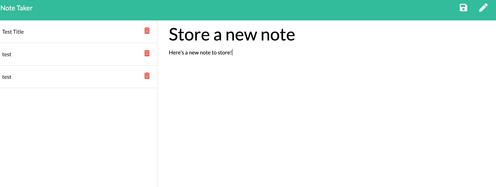

Notation Application
=================================================================

## Table of Contents

-[Introduction](#Introduction)

-[Technology](#Technologies)

-[Screenshots](#Screenshots)
   
-[Usage](#Usage)

-[Credits](#Credits)

-[Contact](#Contact)

-[License](#License) 

## Links

* [Deployed Link](https://boiling-citadel-67370.herokuapp.com/)

## Introduction

This application functions to give users the ability to create, store, retrieve and delete notes with a title and a body. 

## Usage 
In order to run the application, open the server.js file in integrated terminal, run "npm install" to install dependencies, and then run "node server.js".

### Screen Shots

## Technologies

Technology used to create application

* HTML5 (given)

* CSS3 (given)

* Express

* Nodejs

* Npm package uuidv4 - Unique number id generation for notes

* Heroku - Hosting
	

## Project Challenges
*  One of the largest challenges for me in this project turned out to be making sure that I had both my api and html routes written correctly. I spent the most time making adgustments to those routes repeatedly in order to get the application to run.
Also, at the time of deploying the application, I was still unable to get the "delete" function to work, in spite of spending hours over the course of several days tweaking that section of code. 

## Credits

* [Stack Overflow general research](https://stackoverflow.com/) 
* [Mdn web docs general research](https://developer.mozilla.org/en-US/)
* [AskBCS bug fixes]
* [npmjs package uuidv4](https://www.npmjs.com/package/uuidv4)
* [Mdn web docs general research](https://developer.mozilla.org/

## Author
 Meredith Jones

## Contact
 [@MeredithJones](https://github.com/meredithajones)

## License 
This project is licensed under the terms of the MIT license.
